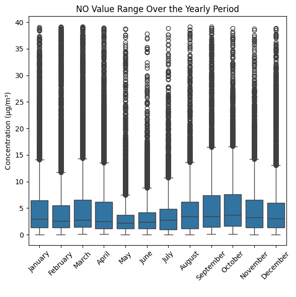
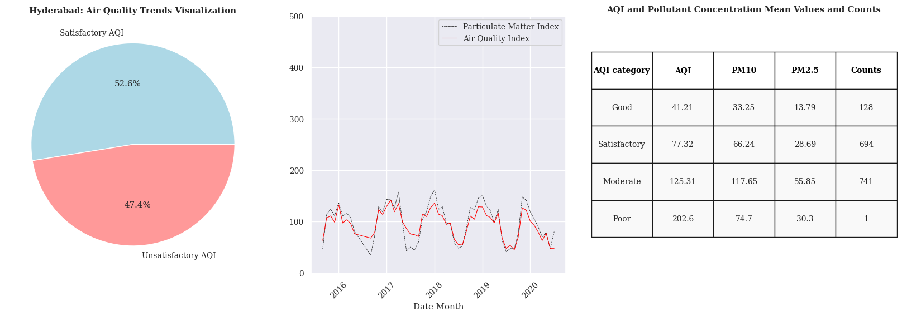

# Overview
Welcome to my first project of Exploratory Data Analysis!
This project was created to analyze the trends in the Air Quality Index (AQI) changes in the seven selected cities in India. It focuses on understanding of the relationships 
between AQI and exposure to other environmental pollutants such as particulate matter (PM2.5 and PM10), nitrogen dioxide (NO2), ozone (O3), or sulfur dioxide (SO2).

The dataset used for this project is the Air Quality Index (AQI) dataset from Kaggle web platform ('https://www.kaggle.com/datasets/rohanrao/air-quality-data-in-india') which provides a foundation for my analysis. The dataset contains information about the AQI and other pollutants in multiple cities in India. I explored the data to understand the trends and relationships between the variables. The analysis was performed using Python with the help of libraries such as Pandas, NumPy, Seaborn, Matplotlib and Scikit-learn.

# The Questions
Below are the questions that I will be answering in this project:

1. What are the average AQI values for each city?
2. What is the main reason of the high AQI value in the selected cities?
3. Are there any similar trends between AQI and other pollutants?
4. Which of the selected cities are the most polluted?

# Tools I Used
For my comprehensive analysis of the dataset, I used the following tools:

Python libraries:
    -**Pandas Library:** for data manipulation and analysis
    -**Numpy Library:** for numerical computations
    -**Matplotlib Library:** for data visualization
    -**Seaborn Library:** for more advanced visuals
    -**Scikit-learn Library:** for machine learning algorithms
    -**Scipy Library:** for statistical computations
-**Jupyter Notebooks:** for interactive coding and visualization
-**Kaggle Dataset:** for the Air Quality Index (AQI) dataset
-**Visual Studio Code** for executing my Python scripts
-**Git & Github** for version control and collaboration

# Data Preprocessing
This section describes the steps I took to prepare the data for analysis.

# Import & Clean Up Data
I start by importing necessary libraries and loading the dataset. Then, I clean up the data by removing any missing values and outliers.

```python
# Importing Libraries & Modules
import pandas as pd
import numpy as np
import matplotlib.pyplot as plt
import seaborn as sns
import datetime as dt
import matplotlib.dates as mdates
import calendar
import kagglehub

from sklearn.linear_model import LinearRegression
from sklearn.metrics import r2_score, mean_squared_error
from scipy import stats

# Download latest version of datasets
path = kagglehub.dataset_download("rohanrao/air-quality-data-in-india")

# Data preprocessing
##Selecting the chosen datasets for this Project
df_station_hour = pd.read_csv(r'C:\Users\Lenovo\.cache\kagglehub\datasets\rohanrao\air-quality-data-in-india\versions\12\station_hour.csv')
df_stations = pd.read_csv(r'C:\Users\Lenovo\.cache\kagglehub\datasets\rohanrao\air-quality-data-in-india\versions\12\stations.csv')
##Creating the df_cities dataset, that selects stations accordingly to the cities they are settled in based on their Station Id
df_station_hour = df_station_hour[df_station_hour['Datetime'].isna() == False]
df_cities = pd.merge(df_station_hour, df_stations, how = 'left', on = 'StationId')

# Data Cleanup
## Removing the Inactive stations from the df_cities dataset
df_cities = df_cities[df_cities['Status'] == 'Active']

##Transforming Datetime Column from Object to Datetime
df_cities['Datetime'] = pd.to_datetime(df_cities['Datetime'])
```

# Removing Outliers from the Dataset
This procedure will provide cleaner dataset more suitable for consistent data analysis and would help in reducing the noise in the data.

```python
#creating the function to remove outliers from the dataset
def remove_outliers(df):
    for column in df.columns:
        Q1 = df[column].quantile(0.25)
        Q3 = df[column].quantile(0.75)
        IQR = Q3 - Q1
        lower_bound = Q1 - 1.5 * IQR 
        upper_bound = Q3 + 1.5 * IQR
        df = df[(df[column] >= lower_bound) & (df[column] <= upper_bound)]
    return df

df_city = df_cities.copy()
df_city.loc[:, 'PM2.5' : 'AQI'] = remove_outliers(df_city.loc[:, 'PM2.5' : 'AQI'])
```
# The Analysis
Each of the Jupyter notebook for this project aimed for a specific predefined output.

## Part 1: Data Cleaning & Introduction
## Key question: What is the basic layout of the data set variables used in this analysis?
To answer this question, I have decided to firstly create a box plot to visualize the distribution layout of each parameter of the dataset.

### Analysis & Visualization
The First Step was to create a Box Plot Visualization of each Parameter

```python
data = df_cities.loc[:, 'PM2.5':'AQI']
filtered_data = remove_outliers(data)
data_box = filtered_data

data_melted = data_box.melt(var_name='Pollutant', value_name='Value')
sns.boxplot(data=data_melted, x='Pollutant', y = 'Value')
plt.title('Value Range of Selected Pollutants')

plt.xticks(rotation=45)
plt.show()
```
### Results


The Second Step was to create a Bar Chart to show the average yearly distribution of each parameter measured in monthly basis (in this case I have used dataset from all of the years)

```python
#Looped version of Yearly Contaminant Box Plot Distribution
values = df_city.loc[0:0, 'PM2.5':'AQI'].columns.to_list()

for value in values:
    fig, ax = plt.subplots(1, figsize=(6,6))
    sns.boxplot(data=df_city, x='Month', y = value, ax= ax)
    ax.set_title(f'{value} Value Range Over the Yearly Period')
    if value == 'PM2.5' or value == 'PM10':
        ax.set_ylabel('Concentration (μm in μg/m³)')
        ax.set_xlabel('')
        ax.tick_params(axis='x', rotation=45)
    elif value == 'AQI':
        ax.set_ylabel('AQI value')
        ax.set_xlabel('')
        ax.tick_params(axis='x', rotation=45)
    else:
        ax.set_ylabel('Concentration (μg/m³)')
        ax.set_xlabel(' ')
        ax.tick_params(axis='x', rotation=45)


    plt.tight_layout()                    
    plt.show()
```
### Results





### Insights
- The distribution of pollutants varies across the year, with some pollutants showing a clear seasonal pattern.
- The average concentration of PM2.5 and PM10, CO is higher in the winter months, while the average concentration of NO, NOx, and O3 show no clear trend.
- The AQI value is higher in the November, December and January, indicating a higher level of air pollution during this period of time related to PM2.5, PM10, and CO concentrations,
possibly indicating the higher rate of combustion processes during the winter months
- The distribution of pollutants is not normally distributed, indicating that the data may not be suitable for parametric tests

## Part 2: Correlation Analysis
## Key question: What are the most Important Pollutants to Consider Based on Their Relevance to Air Quality Index (AQI)?
To answer this question, I performed a correlation analysis between the pollutants and the AQI value.

### Analysis & Visualization
The First Step was to create a Correlation Matrix heatmap to show the correlation of each pollutant with the AQI value. I used the `corr()` function from pandas to calculate the correlation coefficients and the spearman method

```python
#Correlation matrix heatmap creation
data = df_city.loc[:, 'PM2.5' : 'AQI'].copy()
correlation_matrix = data.corr(method='spearman')

plt.figure(figsize = (15,10))
sns.heatmap(correlation_matrix, annot=True, cmap = 'coolwarm', fmt = '.2f')
plt.title('Correlation Matrix of Urban Air Quality Parameters')

plt.show()
```
### Results

- The correlation matrix shows that PM2.5, PM10 are highly correlated with the AQI value

The Second Step was to generate scatterplots displaying the relationship between each pollutant and the AQI value. I used the `scatterplot()` function from seaborn to create more
informative scatterplots, including regression lines and color coding of different categories of AQI values. I also used scikit-learn 's `LinearRegression` to calculate the regression coefficients and the R-squared value for each pollutant and scipy.stats to calculate p-value, whih were displayed on the table next to the scatterplot

```python
# Creating Correlation Scatterplots of Each Selected Paramter of Contaminants towards  Air Quality Index
parameter_values = df_city.loc[0:0, 'PM2.5':'Xylene'].columns.to_list()

## Creating a looped segment to generate scatterplots for each parameter
for value in parameter_values:

##  Calculating the correlation coefficient and p-value between the parameter and AQI
    correlation_coefficient, p_value = stats.spearmanr(df_c_pivot[value], df_c_pivot['AQI'])

##  Creating the model of linear regression and calculating the coefficient of determination (R-squared)
    model = LinearRegression()
    X_reshaped = df_c_pivot[value].values.reshape(-1,1)
    model.fit(X_reshaped, df_c_pivot['AQI'])
    y_pred = model.predict(X_reshaped)
    r2 = r2_score(df_c_pivot['AQI'], y_pred)
##  Creating list of metrics data that will be displayed on the Table next to the Scatterplot
    metrics_data = [
        ['R²', f'{r2:.3f}'],
        ['Spearman Correlation', f'{correlation_coefficient:.3f}'],
        ['p-value', f'{p_value:.3e}']
    ]

##  Creating a Scatterplot with Regression Line and Added Table with Metrics
    fig, (ax, ax2) = plt.subplots(1,2, figsize=(20,6))

    scatter = sns.scatterplot(data=df_c_pivot, x=value, y='AQI', hue='AQI_Bucket', palette='Set1', s=50, ax = ax)
    slope, intercept = np.polyfit(df_c_pivot[value], df_c_pivot['AQI'], 1)
    regression_line = slope * df_c_pivot[value] + intercept

    ax.plot(df_c_pivot[value], regression_line, color='black')

    ax.set_xlabel(value)
    ax.set_title(f'{value} and AQI correlation significance')
    ax.set_ylabel('Air Quality Index (AQI)')
    ax.set_facecolor('#F5DEB3')
    ax.legend(title='AQI Parameters', loc='lower right', bbox_to_anchor=(1, 0), borderaxespad=0.)
    ax.grid(color='black')

### Create the table
    table = ax2.table(cellText=metrics_data, loc='center', cellLoc='center')
    ax2.axis('off')

    table.auto_set_font_size(False)  
    table.set_fontsize(10)  
    table.scale(0.5, 4) 

##  Showing the plot
    plt.show()
```
### Results


- The results show that there is a strong positive correlation between PM2.5 and PM10 and AQI, with a high R-squared value indicating that the linear regression model is a good fit for the data. 
- The p-value is also completely insignificant, indicating that the correlation is statistically significant. This suggests that PM 2.5 and PM10 are good predictors of AQI. 

The third step was to create a calculated index values that should positively mimic the relationship of selected pollutants to correlation with AQI values. This was done by multiplying the value of each pollutant concentration by the Spearman correlation index and summing these values to create a new index reflecting a specific category of pollutants.
These indexes were later analyzed in their relationship towards AQI values in the scatterplots mentioned above. The results of these scatterplots are shown below in the results.

```python
# Creating Index Values of Selected Parameters in the DataFrame

def all_indexes(pivot_list):
    aqi_correlations = correlation_matrix['AQI']
    correlations_aqi = list(float (x) for x in aqi_correlations.values[:-1])
    params_aqi = list(aqi_correlations.index[:-1])
    for i in range(len(pivot_list)):
        pivot_list[i]['Weighted Sum Index'] = pivot_list[i].apply(lambda x: sum(x[col]*correlations_aqi[c] for c, col in enumerate(params_aqi) if col in pivot_list[i].columns.to_list()), axis=1)

    correlations_aqi = list(float (x) for x in aqi_correlations.values[:2])
    params_aqi = list(aqi_correlations.index[:2])
    for i in range(len(pivot_list)):
        pivot_list[i]['Particulate Matter Index'] = pivot_list[i].apply(lambda x: sum(x[col]*correlations_aqi[c] for c, col in enumerate(params_aqi) if col in pivot_list[i].columns.to_list()), axis=1)

    correlations_aqi = list(float (x) for x in aqi_correlations.values[2:6])
    params_aqi = list(aqi_correlations.index[2:6])
    for i in range(len(pivot_list)):
        pivot_list[i]['Nitrogen Index'] = pivot_list[i].apply(lambda x: sum(x[col]*correlations_aqi[c] for c, col in enumerate(params_aqi) if col in pivot_list[i].columns.to_list()), axis=1)
    
    correlations_aqi = list(float (x) for x in aqi_correlations.values[6:9])
    params_aqi = list(aqi_correlations.index[6:9])
    for i in range(len(pivot_list)):
        pivot_list[i]['Oxydative Gases Index'] = pivot_list[i].apply(lambda x: sum(x[col]*correlations_aqi[c] for c, col in enumerate(params_aqi) if col in pivot_list[i].columns.to_list()), axis=1)

    correlations_aqi = list(float (x) for x in aqi_correlations.values[9:-1])
    params_aqi = list(aqi_correlations.index[9:-1])
    for i in range(len(pivot_list)):
        pivot_list[i]['Volatile Organic Compounds (BTX) Index'] = pivot_list[i].apply(lambda x: sum(x[col]*correlations_aqi[c] for c, col in enumerate(params_aqi) if col in pivot_list[i].columns.to_list()), axis=1)
    return pivot_list

list_c = []
list_c.append(df_c_pivot)
list_c = all_indexes(list_c)
```
### Results


The Last Step of this analysis was to crate a linechart showing representative changes of selected indexes and their similarities with the AQI values

```python
#AQI and WSI Monthly Distribution in Cities and Urban Areas

fig, ax = plt.subplots(figsize=(20,6))

ax.set_title('Urban Areas: Index Value Time Distribution', weight='bold')
ax.set_xlabel('Date Month')
ax.set_ylabel('Index Values') 
ax.tick_params(axis = 'x', rotation=45)
sns.lineplot(x='Date_Month', y='Weighted Sum Index', color = 'blue', data=m_c_pivot, ax=ax, linewidth = 0.75, label = 'Weighted Sum Index')
sns.lineplot(x='Date_Month', y='Particulate Matter Index', color = 'black', data=m_c_pivot, ax=ax,linewidth = 1.25, label = 'Particulate Matter Index')
sns.lineplot(x='Date_Month', y='Nitrogen Index', color = 'green',  data=m_c_pivot, ax=ax,linewidth = 0.75, label = 'Nitrogen Index')
sns.lineplot(x='Date_Month', y='Oxydative Gases Index', color = 'orange', data=m_c_pivot, ax=ax,linewidth = 0.75, label = 'Oxydative Gases Index')
sns.lineplot(x='Date_Month', y='AQI', color = 'red', data=m_c_pivot, ax=ax,linewidth = 1.5, label = 'Air Quality Index')


ax.set_ylim(0,500)
ax.xaxis.set_major_locator(mdates.YearLocator())
ax.xaxis.set_major_formatter(mdates.DateFormatter('%Y'))

ax.legend()
plt.show()
```
### Results


### Insights
- The Weighted Sum Index (WSI) is the most correlated with the Air Quality Index, however, it is not the most significant one. This is due to the fact that the WSI is calculated only for the 
precision purposes. As it is clear from the line chart, it almost mimics the AQI values, but is at least 50 to 60 points higher. That indices other elements, that affect AQI value calculation and can not be derived from the pollutant concentration mentioned in this dataset, like weather patterns, wind velocity or air moisture.

- The Particulate Matter Index (PMI) is the second most correlated with the Air Quality, it also has almost significant values with the AQI. Even though it still might be a coincidence, it is a powerful indication of relevance towards the consideration of air quality measurements. Therefore, I have chosen Particulate Matter Index as a main index to determine the relation of pollutant concentration in relation to the AQI.

- The Oxydative Gases Index (OI) is the second most correlated with the Air Quality Index compared to other indexes. However, it is definitely not as significant as the Particulate Matter Index. This is due to quite low R squared value and Spearman correlation coefficient. This is not a surprise, as the Oxydative Index might indicate some affection to the AQI, but mostly in its possible relation to secondary pollutants like the increase of surface O3 when it is exposed to UV radiation from sunlight in the mixture with volatile organic compounds and nitrogen gases.

## Part 3: City Comparison & Conclusions
## Key question: What Is The Most Relevant Way To Visualize The Difference of Air Quality Between Selected Cities?
To answer this question, I decided to select 7 Top Tier Cities with the most relevant data available. This has been performed by the count of AQI values measure in each city, after the dataset has been removed from outliers and cleaned from the missing values. Later on, I used these top 7 cities as variables visualize differences in mean AQI values and selected mean PM index values.

### Analysis & Visualization
In order to proceed with the analysis, I have firstly created a dataset column that divides seleted top tier 7 cities from the other cities mentioned in the dataset.

```python
# Remove empty values from the dataset accordingly to the selected column
df_city = df_city[df_city['PM2.5'].isna()==False]

# Selecting top 7 cities with the highest count of AQI measurements
top_7_cities = df_city.groupby('City').size().reset_index().rename(columns={0:'Counts'}, inplace = False).sort_values(by='Counts', ascending=False).head(7)

# Creating a list of Selected 7 Top Tier Cities (Sorted in the Order of the Highest Mean AQI Measurements)
cities = ['Delhi', 'Visakhapatnam', 'Amaravati', 'Hyderabad', 'Amritsar', 'Chandigarh', 'Kolkata']

# Creating a column dividing 7 Top Tier Cities from Other Cities
df_city['top_7'] = df_city['City'].apply(lambda x: x if x in cities else 'other cities')

# Creating a Pivot Table to Display the Count of AQI Measurements for Each Top Tier City and Other Cities
top_cities = df_city.groupby('top_7').size().reset_index().rename(columns={0:'Counts'}, inplace = False).sort_values(by='Counts', ascending=False)
```
Then I decided to display the Top Tier 7 cities on the pie plot visualization to show the percentual distribution of measure counts per each city

```python
# Top tier 7 cities  pie plot visualization
sns.set_theme(palette='pastel', font='serif', font_scale=0.9)


plt.pie(top_cities['Counts'].tolist(), labels=top_cities['top_7'].tolist(), autopct='%1.1f%%')

plt.figure(figsize=(24,24))
plt.show()
```
### Results

- The pie chart show the percentual distribution of AQI measurements per each of the selected top tier 7 cities. 

The Second Step was to generate barcharts displaying the count of days when the AQI of measures per each city and the mean AQI value per each city. 

```python
# bar plot mean AQI measures by Cities
sorted_df_city_p = df_city_p.sort_values(by='AQI').copy()
plt.barh(sorted_df_city_p['top_7'], sorted_df_city_p['AQI'], color = 'brown')
plt.xticks(rotation=45)

plt.xlabel('AQI')
plt.title('Mean AQI Values in Top 7 Cities', weight='bold')

#barplot Day counts by Cities

plt.barh(city_days['Cities'], city_days['Day_Counts'], color = 'black')
plt.xticks(rotation=45)

plt.xlabel('AQI')
plt.title('Count of Days of AQI Measurement in Top 7 Cities', weight='bold')
```
### Results


The Third Step was to generate a scatter plot displaying the relationship between the AQI and the selected indexes for different cities and calculating Spearman correlation coefficient,
R-squared value and p-value.

```python
#City Scatterplots

indexes = df_c.loc[0:0,'Weighted Sum Index':'Volatile Organic Compounds (BTX) Index'].columns.to_list()

colors = ['blue', 'black', 'green', 'red', 'brown']

for a  in range(len(indexes)):
    fig, (ax1, ax2) = plt.subplots(1,2, figsize=(15,6))
    sns.scatterplot(data = df_city_p, x=indexes[a], y = 'AQI', color=colors[a], ax = ax1)

    for i in range(len(df_city_p)):
        aqi_mean = df_city_p['AQI'].iloc[i]
        parameter_mean = df_city_p[indexes[a]].iloc[i]
        city_name = df_city_p['top_7'][i]
        ax1.text(parameter_mean, aqi_mean, city_name, ha='center', va='bottom')
    
    ax1.set_title('Cities: Mean AQI and Parameter Index Ratio')
    ax1.set_xlabel(indexes[a])
    ax1.set_ylabel('Air Quality Index (AQI)')
    
    # Calculate Pearson Correlation Coeffcient and p-value
    correlation_coefficient, p_value = stats.spearmanr(df_city_p[indexes[a]], df_city_p['AQI'])

    # Model Linear Regression and Calculate R-squared value
    model = LinearRegression()
    X_reshaped = df_city_p[indexes[a]].values.reshape(-1,1)
    model.fit(X_reshaped, df_city_p['AQI'])
    y_pred = model.predict(X_reshaped)
    r2 = r2_score(df_city_p['AQI'], y_pred)

    metrics_data = [
        ['R²', f'{r2:.3f}'],
        ['Spearman Correlation', f'{correlation_coefficient:.3f}'],
        ['p-value', f'{p_value:.3e}']
    ]

    # Create the table of R-squared , Pearson Correlation and p-value
    table = ax2.table(cellText=metrics_data, loc='center', cellLoc='center')
    ax2.axis('off')
    ax2.axis('off')

    table.auto_set_font_size(False)  # Disable automatic font size
    table.set_fontsize(10)  # Set font size
    table.scale(0.5, 4)  # Scale the table size

    plt.grid(True)

    plt.tight_layout()
    plt.show()
```

### Results


- The Results show that Weighted Sum Index proves the most significant correlation with AQI amont the cities, but Particulate Matter Index is very similar, with almost even r2 and Spearman correlation score values, even though the p-value is a little higher than 0,05. This shows that the Particulate Matter Index  might be good quantifier of AQI across the cities.
- Surprisingly, even Nitrogen Index shows a good correlation with AQI, even though it is not as strong as the Weighted Sum Index. In comparison, the Oxydative Gases Index shows a very weak correlation with AQI. This might be due to the inconsistent pattern of irritable gases increase based on the NxOy pollutants concentration in the atmosphere or the amount of other gases produced by combustion. Therefore, no other index than PM index will be further used to testify correlation of AQI to  airborne atmospheric pollutant concentration across the cities.

The Fourth Step was to generate a diagram of air quality trends for each city, consisting of a pie chart showing the number of days with satisfactory and unsatisfactory AQI, a line chart showing the changes in AQI values and the Particulate Matter Index over monthly periods, and a table showing the mean values of particulate matter concentration for each measured AQI category.

```python
#City Air Quality Trends Visualization

l_cities = ['Delhi', 'Visakhapatnam', 'Amaravati', 'Hyderabad', 'Amritsar', 'Chandigarh', 'Kolkata']
colors = ['#ADD8E6','#FF9999']

for i in range(7):
    sns.set_theme(palette='pastel', font='serif', font_scale=0.9)
    d_stat_pivot[i].loc[:,'AQI_min':'NH3_mean'] = d_stat_pivot[i].loc[:,'AQI_min':'NH3_mean'].round(2)

    fig, (ax1, ax2, ax3) = plt.subplots(1,3, figsize=(20,6))

    labels= dd_stat_pivot[i]['Satisfactory_AQI'].tolist()
    changed_labels = ['Satisfactory AQI' if label == 'Satisfactory' else 'Unsatisfactory AQI' for label in labels ]

    ax1.pie(dd_stat_pivot[i]['Count'].tolist(), labels=changed_labels,autopct='%1.1f%%', colors = colors)
    ax1.set_title(f'{l_cities[i]}: Air Quality Trends Visualization', weight='bold')

    ax2.set_ylabel(' ')
    ax2.set_xlabel('Date Month')
    ax2.tick_params(axis = 'x', rotation=45)
    sns.lineplot(x='Date_Month', y='Particulate Matter Index', color = 'black', linestyle='--', linewidth=0.5, data=monthly_p[i], ax=ax2, label = 'Particulate Matter Index')
    sns.lineplot(x='Date_Month', y='AQI',color = 'red', linewidth=0.75, data=monthly_p[i], ax=ax2, label = 'Air Quality Index')
    ax2.xaxis.set_major_locator(mdates.YearLocator())
    ax2.xaxis.set_major_formatter(mdates.DateFormatter('%Y'))
    ax2.set_ylim(0,500)

    table_data = [d_stat_pivot[i]['AQI_Bucket'],d_stat_pivot[i]['AQI'], d_stat_pivot[i]['PM10_mean'], d_stat_pivot[i]['PM2.5_mean'],d_stat_pivot[i]['Count']]
    table = ax3.table(cellText=np.array(table_data).T, colLabels=['AQI category', 'AQI', 'PM10', 'PM2.5', 'Counts'], loc='center')
    ax3.axis('off')
    ax3.set_title('AQI and Pollutant Concentration Mean Values and Counts', weight='bold')
    table.auto_set_font_size(False)  # Disable automatic font size
    table.set_fontsize(10)  # Set font size
    table.scale(1.2, 4)  # Scale the table size

    # Change the color of the header
    for (a, b), cell in table.get_celld().items():
        if a == 0:  # Header row
            cell.set_text_props(weight='bold', color='black')

        else:
            cell.set_facecolor('#f9f9f9')
            cell.set_text_props(ha='center')
                         
    plt.show()
```
### Results





- The above images show the AQI trends for Delhi, Hyderabad, and Kolkata. The AQI trends clerly show, That the most polluted city among top tier cities is Delhi, while cities like Visakhapatnam and Hyderabad show less moderate pollution trends. Other cities resembled the distribution of Kolkata, which showed that more than 60% of mean measurements per day provided satisfactory results for AQI.

## Additional Information
For the better understanding of the city -wise AQI trends, the following information is provided:
1. **Particulate Matter Mean Concentration** - The mean concentration of particulate matter (PM10 and PM2.5) in the air for each selected city

```python
#Bar plot mean PM concentration measures by Top Tier Cities
sorted_df_city_p = df_city_p.sort_values(by='AQI').copy()

fig, ax = plt.subplots(1, figsize=(8,6))

sns.barplot(x = sorted_df_city_p['top_7'], y = sorted_df_city_p['PM10'], color = 'grey', ax = ax, legend = True)
sns.barplot(x = sorted_df_city_p['top_7'], y = sorted_df_city_p['PM2.5'], color = 'black', ax = ax, legend = True)
ax.tick_params( axis = 'x', rotation=45)
ax.set_ylabel('PM particle concentration (μm in μg/m³)', weight='bold')
ax.set_xlabel(' ')
ax.set_title('Mean PM Concentration in 7 Top Tier Cities', weight='bold')


handles = [
    plt.Line2D([0], [0], color='grey', lw=4, label='PM10'),
    plt.Line2D([0], [0], color='black', lw=4, label='PM2.5')
]
ax.legend(handles=handles, title='Particle Types')

plt.tight_layout()
plt.show()
```
### Results


2. **Above Threshold PM concentrations in Scatterplot** - The scatter plot of PM concentrations for each selected city represented in percentual units of WHO threshold guidelines

```python
# Create a scatter plot showing the distribution of the maximum values of the PM particle concentration in a metric of the percentage exceeding the threshold (WHO)
norm_values =  ['PM2.5', 'PM10']
norm_limits = [75, 150]

for v in range(len(norm_values)):
        df_c[f'{norm_values[v]} norm %'] = (df_c[norm_values[v]] / norm_limits[v]) * 100
        df_c[f'{norm_values[v]} satisfactory'] = df_c[f'{norm_values[v]} norm %'] <= 100


df_c_p = df_c.pivot_table(values = ['PM2.5 norm %', 'PM10 norm %', 'AQI'], index = 'top_7', aggfunc = 'max').reset_index()
df_c_p = df_c_p[df_c_p['top_7'] != 'other cities']

colors = ['black']

fig, ax1 = plt.subplots(1, figsize=(15,6))
sns.scatterplot(data = df_c_p, x='PM10 norm %', y = 'PM2.5 norm %', color=colors[0], ax = ax1)

for i in range(len(df_c_p)):
    max25 = df_c_p['PM2.5 norm %'].iloc[i]
    max10 = df_c_p['PM10 norm %'].iloc[i]
    city_name = df_c_p['top_7'][i]
    ax1.text(max10, max25, city_name, ha='center', va='bottom')
    
ax1.set_title('Cities: Max Values of Particulate Matter Concentration Exceeding Limit', weight='bold')
ax1.set_xlabel('PM10 max value in %', weight='bold')
ax1.set_ylabel('PM2.5 max value in %', weight='bold')
```
### Results


3. **Days above threshold of PM concentrations Pie Chart** - Pie charts displaying number of days when Particulate Matter concentrations exceeded the threshold in each city

```python
# Pie chart distribution by each Top Tier City showing the number of days of mean concentration of airborne PM particles above threshold limit
norm_values =  ['PM2.5', 'PM10', 'NO2', 'O3', 'CO']
norm_limits = [75, 150, 120, 160, 7]

norm_df = pd.DataFrame()

for i in range(len(norm_values)):
    norm_df[norm_values[i]] = [norm_limits[i]]

l_cities = ['Delhi', 'Visakhapatnam', 'Amaravati', 'Hyderabad', 'Amritsar', 'Chandigarh', 'Kolkata']
colors = ['#ADD8E6','#FF9999']

for i in range(len(daily_p)-1):
    city = l_cities[i]
    daily_p[i]['City'] = city
    for v in range(len(norm_values)):
        daily_p[i][f'{norm_values[v]} norm %'] = (daily_p[i][norm_values[v]] / norm_limits[v]) * 100
        daily_p[i][f'{norm_values[v]} satisfactory'] = daily_p[i][f'{norm_values[v]} norm %'] <= 100

# Pieplots showing percentages of  day counts where mean values of PM10 and PM2.5 particles exceeded WHO regulations

for i in range(len(daily_p)-1):
    labels = ['Above Threshold', 'Below Threshold']

    colors = ['grey','lightgrey']
    values_l = []

    for v in range(2):
        input = daily_p[i].groupby(f'{norm_values[v]} satisfactory').size().to_frame().reset_index()

        labels = ['Days Above Threshold', 'Days Below Threshold']

        colors = ['#FF9999','lightgrey']

        values = input[0].to_list()
        values_l.append(values)

    fig, [ax1,ax2] = plt.subplots(2,1, figsize=(10, 10))
    ax1.pie(values_l[0], labels=labels, autopct='%1.1f%%', colors=colors)
    ax1.set_title(f'{l_cities[i]}: {norm_values[0]}', weight='bold')

    ax2.pie(values_l[1], labels=labels, autopct='%1.1f%%', colors=colors)
    ax2.set_title(f'{l_cities[i]}: {norm_values[1]}', weight='bold')
    plt.show()
```
### Results


# Conclusions
- The results in general show, that the most polluted city is Delhi, followed by Visakahpatnam and Hyderabad, which is probably due to high concentrations of airborne particulate matter (PM2.5, PM10)
- Particulate Matter concentrations do not always completely reflect the distribution of air quality in cities, but they are the main indicators to consider when to assess the air quality in cities 
- For more accurate results, it is recommended to consider other factors that can affect the air quality, such as temperature, humidity, or wind speed
